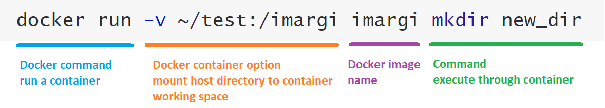

# Tools and Installation

In the iMARGI pipeline, a bundle of tools and several bash scripts created by us are required. For convenience and
reproducibility, we built [iMARGI-Docker](https://hub.docker.com/r/zhonglab/imargi) to distribute the pipeline.
It delivers all the well configured tools.

- [Tools and Installation](#tools-and-installation)
  - [System Requirements](#system-requirements)
    - [Hardware Requirements](#hardware-requirements)
    - [Software Requirements](#software-requirements)
  - [Docker Container Usage Instructions](#docker-container-usage-instructions)
  - [Dependencies Instruction](#dependencies-instruction)

## System Requirements

### Hardware Requirements

There isn't specific high performance hardware requirements of running iMARGI-Docker. However, as iMARGI generates hugh
amount of sequencing data, usually more than 300 million read pairs, so a high performance computer will save you a lot
of time. Generally, a faster multi-core CPU, larger memory and hard drive storage will benefits you a lot. We suggest
the following specs:

- CPU: At least dual core CPU. More CPU cores will speed up the processing.
  
- RAM: 16 GB or more. Depends on the size of reference genome. For human genome, at least 8GB free memory are required by BWA,
  so the memory on the machine needs to be more than 8 GB, which usually is 16 GB. **Out of memory will cause ERROR.**

- Hard drive storage: Depends on your data, typically at least 160 GB free space is required for 300M 2x100 read pairs.
  Besides, fast IO storage is better, such as SSD.

### Software Requirements

iMARGI-Docker only requires Docker. You can use [Docker Community Edition (CE)](https://docs.docker.com/install/).
**We recommend using mainstream Linux system (64-bit), including Ubuntu, Debian, Fedora, and CentOS.** Because it's
much easier to setup and its filesystem is better for large file processing. You can install Docker CE with two commands
on these well supported Linux distributions.

``` Bash
# install Docker, support Ubuntu, Debian, Fedora, and CentOS
sudo curl -fsSL https://get.docker.com |sh -

# set Docker user, replace demo_user with you own user name,
# then you can use docker command without sudo
sudo usermod -aG docker demo_user
```

Docker supports all the mainstream OS, such as Linux, Windows and macOS. You can check the
[Technical Notes of installing Docker on different systems](https://sysbio.ucsd.edu/imargi_pipeline/technical_note.html#install-docker-on-different-systems)
to learn how to install Docker on other systems.

Most of time, the operations in macOS is the same as in Linux system, as it's also a Unix system. However, if you are
using Windows system, some command lines need to be modified. Besides, you need to configure the CPU and memory settings
of Docker. There is default 2 GB limit of memory to Docker on Windows or macOS (no limit on Linux). You must increase it
to more than 8 GB. You can check the
[Technical Notes of change Docker settings](https://sysbio.ucsd.edu/imargi_pipeline/technical_note.html#change-docker-memory-settings-on-windows-and-macos)
to learn how to do it. You might encounter some other problems caused by system settings specifically to Windows or macOS,
please check the [Guides for Issues on Windows and macOS System page](https://sysbio.ucsd.edu/imargi_pipeline/faq_win_mac.html)
to find a solution.

After installation, the Docker service might be automatically started on some system (such as Ubuntu), but for other
systems, it needs to be started manually with root privilege. Start the Docker service. You can choose a proper Linux
command to start it.

- Ubuntu, Debian, Fedora: `sudo service docker start`
- CentOS: `sudo systemctl start docker`
  
For macOS and Windows users, you need to start the Docker Desktop or Docker Toolbox application.

## Docker Container Usage Instructions

An iMARGI Docker image is available in [Docker-Hub](https://hub.docker.com/r/zhonglab/imargi), and its source files are
hosted in [iMARGI-Docker GitHub repo](https://github.com/Zhong-Lab-UCSD/iMARGI-Docker). It's much easier to apply the
iMARGI pipeline using the docker container than installing and configuring all the required tools.

First of all, you need to start your Docker service (daemon).

For some Linux systems, such as Ubuntu, the Docker service might automatically start after installation. You can check
it by run a demo `hello-world` test container by the command below. It will tell you "your installation appears to be
working correctly" if your Docker service has been started.

``` Bash
# test Docker service
docker run --rm hello-world
```

If the service hasn't been started, you can choose a proper Linux command to start it. And then test again. For Ubuntu,
Debian, and Fedora, use `sudo service docker start`, and for CentOS, use `sudo systemctl start docker`. For macOS and
Windows users, you need to start the Docker Desktop or Docker Toolbox application.

Then you can install iMARGI-Docker using the following command.

```bash
docker pull zhonglab/imargi
```

To use the tools in the iMARGI Docker image, you need to run a Docker container. Here is an example of creating a
new directory with `mkdir` command through a Docker container.

``` bash
docker run --rm -t -u 1043 -v ~/test:/imargi zhonglab/imargi mkdir new_dir
```



The option part shows the main option parameters of running a docker command. For more usage information of Docker, please
refer to [Docker official documentation](https://docs.docker.com/engine/reference/commandline/cli/).

- `--rm`: By default a container’s file system persists even after the container exits. Hence, the container file
  systems can really pile up. `--rm` option will automatically clean up the container after the container exits.

- `-t`: Allocate a pseudo-TTY. Without `-t`, you cannot use `Ctrl + c` to stop the run.

- `-u 1043`: Run docker with your own UID of your Linux system (use `id` command to check your own UID and replace
  `1043` with it) to avoid file/dir permission problem.

- `-v`: The `-v` or `--volume` option mounts the `~/test` directory on your host machine to the working directory `/imargi` of
  the iMARGI-Docker container, which is the default working space of iMARGI-Docker. So the container can operate the
  files in `~/test` directory. If you are using Docker on Windows, the path is a little different. For example, Windows
  path `D:\test\imargi_example` needs to be rewritten as `/d/test/imargi_example`, so the `-v` argument needs to be `-v /d/test/imargi_example:/imargi`.
  When you executed it on Windows, a window might pop up to verify that you want to share the folder.

The command executed part in the example, `mkdir new_dir`, creates a folder `new_dir` in the default working space of
the container, which is `/imargi`. As we used `-v ~/test:/imargi` option, so the `~/test/`directory on your host machine
has been mounted as `/imargi` in the iMARGI-Docker container. So the `new_dir` folder will show in your `~/test/` directory.
You can change the command part to use any tool in the iMARGI Docker container.

## Dependencies Instruction

We strongly recommend using iMARGI-Docker instead of configuring all the dependencies of iMARGI pipeline on your Linux
server. However, if you really cannot run Docker on your machine, you might want to try to configure these tools. It
requires root access to your machine and solid experience of Linux server administration.

We cannot guarantee success of local configuration. If you encounter some problems or have suggestions, please view or
create issues in the [iMARGI-Docker GitHub repo](https://github.com/Zhong-Lab-UCSD/iMARGI-Docker). If you are using Ubuntu
(18.04), the following command lines we used to configure iMARGI-Docker might be helpful.

``` bash
# run with root account
apt-get update
apt-get install git build-essential libz-dev libbz2-dev liblzma-dev libssl-dev libcurl4-gnutls-dev \
    autoconf automake libncurses5-dev wget gawk parallel
cd /tmp && git clone -b v1.3 https://github.com/lh3/seqtk.git && \
    cd seqtk && make && make install
cd /tmp && git clone -b 1.9 https://github.com/samtools/htslib && \
    cd htslib && autoheader && autoconf && \
    ./configure --prefix=/usr/local && make && make install
cd /tmp && git clone -b 1.9 https://github.com/samtools/samtools && \
    cd samtools && autoheader && autoconf && \
    ./configure --prefix=/usr/local && make && make install
cd /tmp && git clone -b v0.7.17 https://github.com/lh3/bwa.git && \
    cd bwa && make && cp bwa /usr/local/bin
cd /tmp && git clone https://github.com/nh13/pbgzip && \
    cd pbgzip && sh autogen.sh && ./configure && make && make install
cd /tmp && git clone -b v1.8.3 https://github.com/lz4/lz4 && \
    cd lz4 && make && make install
cd /tmp && wget http://ftp-trace.ncbi.nlm.nih.gov/sra/sdk/2.9.4/sratoolkit.2.9.4-ubuntu64.tar.gz && \
    tar zxvf sratoolkit.2.9.4-ubuntu64.tar.gz && cp -R sratoolkit.2.9.4-ubuntu64/bin/* /usr/local/bin

apt-get install -y python3-dev libopenblas-dev python3-pip
pip3 install numpy cython scipy pandas click
pip3 install pairtools cooler HTSeq
```

The following table shows all the dependencies with simple descriptions. Some of these tools, such as `bash`, `sort`
and `zcat` are usually default installed in most of Linux distributions. Besides, you might need root access or
compiling tools on Linux system to install some of these tools.

Tool | Version  | Installation | Brief description
---------|----------|---------|-----------
Python | 3.x | [Following instruction](https://www.python.org/downloads/) | Running environment for several tools
seqtk | 1.3 | [Following instruction](https://github.com/lh3/seqtk)| Processing FASTA/FASTQ files
bwa | 0.7.17 | [Following instruction](https://github.com/lh3/bwa) | Mapping reads to reference genome
samtools | 1.9 | [Following instruction](http://www.htslib.org/download/)| Manipulating SAM/BAM files
htslib | 1.9 | [Following instruction](http://www.htslib.org/download/)| Manipulating SAM/BAM files
pairtools | 0.2.2 | [Following instruction](https://pairtools.readthedocs.io/en/latest/installation.html)| Utilities for processing interaction pairs
lz4 | 1.8.3 | [Following instruction](https://github.com/lz4/lz4) | Extremely fast compression
pbgzip | - | [Following instruction](https://github.com/nh13/pbgzip)| Compression for Genomics Data
cooler | 0.8.3 | [Following instruction](https://github.com/mirnylab/cooler)| Utilities for genomic interaction data
HTSeq | 0.11.2 | [Following instruction](https://htseq.readthedocs.io/en/master/install.html)| Utilities for annotating interactions
SRA Toolkit | 2.9.4  | [Following instruction](https://github.com/ncbi/sra-tools) | NCBI SRA tools
GNU parallel | - | Linux package "parallel" | Executing jobs in parallel
[GNU awk](https://www.gnu.org/software/gawk/manual/html_node/Quick-Installation.html)| - | Linux package "gawk", set alias awk | Text file processing tool
bash | - | Linux package "bash" | Shell environment
sort | - | Linux package "sort" | Sort text
gunzip | - | Linux package "gunzip" | Compression tool
zcat | - | Linux package "zcat" | Readout compressed text file

After you installed all those dependencies, you need to get all the iMARGI-Docker tools from its GitHub repository:

[https://github.com/Zhong-Lab-UCSD/iMARGI-Docker](https://github.com/Zhong-Lab-UCSD/iMARGI-Docker)

You can `git clone` the master branch, which is the same as the latest release. And then copy all the script tools named
with prefix `imargi_` to your executable PATH, such as the following commands.

``` bash
cd /tmp && git clone https://github.com/Zhong-Lab-UCSD/iMARGI-Docker.git &&\
    cp iMARGI-Docker/src/imargi_* /usr/local/bin/

chmod +x /usr/local/bin/imargi_*
```

The iMARGI-Docker script tools are listed in the table below.

Tool | Installation | Brief description
---------|---------|-----------
imargi_wrapper.sh | Download and `chmod +x` | All-in-one pipeline wrapper
imargi_clean.sh | Download and `chmod +x` | Clean iMARGI paired end fastq files
imargi_parse.sh | Download and `chmod +x` | Parse BAM to valid RNA-DNA interaction pairs
imargi_stats.sh | Download and `chmod +x` | Simple stats report of .pairs file
imargi_convert.sh | Download and `chmod +x` | Convert .pairs format to other formats
imargi_distfilter.sh | Download and `chmod +x` | Filter .pairs or BEDPE file with genomic distance threshold
imargi_rsfrags.sh | Download and `chmod +x` | Generate restriction fragment BED file
imargi_restrict.py | Download and `chmod +x` | Restriction site analysis of .pairs file
imargi_annotate.sh | Download and `chmod +x` | Annotate RNA/DNA-ends with genomic annotations
imargi_ant.py | Download and `chmod +x` | Annotate RNA/DNA-ends with genomic annotations, used by imargi_annotate.sh