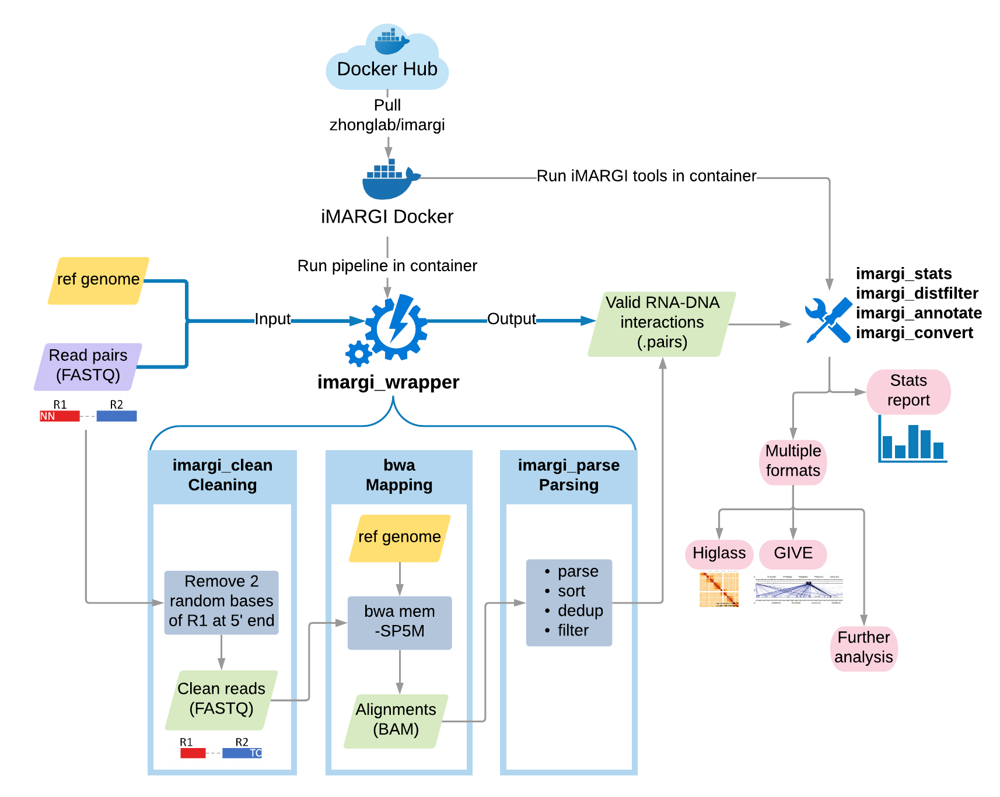
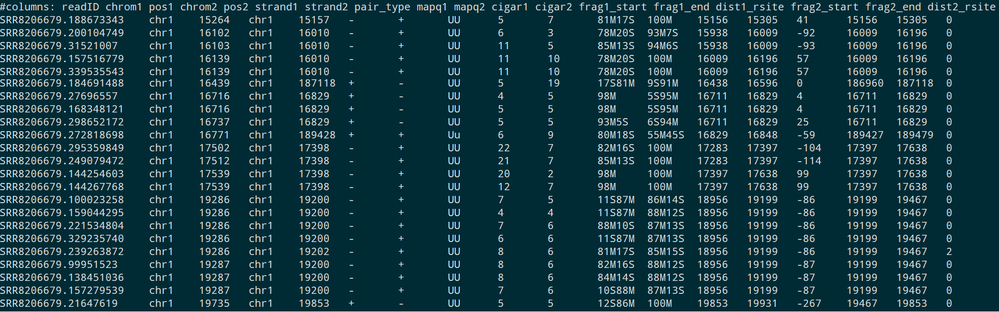

# Step-by-step Illustration

In the [Quick Start Example](./quick_example.md) section, we have shown the simplest all-in-one command line of
performing the pipeline with a wrapper script `imargi_wrapper.sh`. Here we go inside of the quick example to illustrate
the details of iMARGI Pipeline. If you want to customize your pipeline, you can run each step separately with
corresponding tools.


<i><center>Schematic overview of the iMARGI data analysis pipeline </i></center>

- [Step-by-step Illustration](#step-by-step-illustration)
  - [The `imargi_wrapper.sh` Running Command](#the-imargi_wrappersh-running-command)
  - [Generating Required Reference Files](#generating-required-reference-files)
    - [Generating Chromosome Sizes File](#generating-chromosome-sizes-file)
    - [Building BWA Index](#building-bwa-index)
    - [Generating Restriction Fragment File](#generating-restriction-fragment-file)
  - [Cleaning: clean read pairs](#cleaning-clean-read-pairs)
  - [Mapping: map reads to genome](#mapping-map-reads-to-genome)
  - [Parsing: parse mapped read pairs to valid RNA-DNA interactions](#parsing-parse-mapped-read-pairs-to-valid-rna-dna-interactions)
  - [Output Files](#output-files)
    - [All The Output File List](#all-the-output-file-list)
    - [The iMARGI Pipeline Output .pairs Format](#the-imargi-pipeline-output-pairs-format)

## The `imargi_wrapper.sh` Running Command

In the [quick example](./quick_example.md) section, we use the following command of `imargi_wrapper.sh`, whose input
are only sequencing read pairs FASTQ files and reference genome sequence FASTA file.

``` bash
docker run -v ~/imargi_example:/imargi imargi imargi_wrapper.sh \
    -r hg38 \
    -N HEK_iMARGI \
    -t 16 \
    -g ./ref/GRCh38_no_alt_analysis_set_GCA_000001405.15.fasta \
    -1 ./data/SRR8206679_1.fastq.gz \
    -2 ./data/SRR8206679_1.fastq.gz \
    -o ./output
```

We only set a few arguments in the command which are described below, and use default settings for other arguments.

- `-r`: Name of reference genome. It will be used in header of .pairs format file and names of new generated
    reference files.
- `-N`: Name of sample. It will be used in names of final output files.
- `-g`: Reference genome sequence FASTA file.
- `-1` and `-2`: Sequencing read pairs FASTQ files.
- `-t`: Maximum CPU cores.
- `-o`: Output directory

In fact, there are more arguments of `imargi_wrapper.sh` can be set, you can check the full arguments in the
[Command-line API](./commandline_api.md) section. Here we want to remind you the following three arguments of required
reference files, including chromosome sizes file, bwa index and restriction fragments bed format file. Because we didn't
set these arguments in the command line, `imargi_wrapper.sh` automatically generated them. If you have already got these
files, you can use these arguments and it will save you some time and disk space. When the three arguments are all set
correctly, the `-g` argument is not needed.

- `-c`: Chromosome sizes file
- `-i`: bwa index
- `-R`: Restriction fragments bed format file

The following sections are detail illustrations of how `imargi_wrapper.sh` works inside of the iMARGI Docker
container.

## Generating Required Reference Files

As we only input reference genome sequence FASTA file with `-g` argument, so `imargi_wrapper.sh` will automatically
generate other required reference files, such as chromosome sizes, bwa index and restriction fragments.

### Generating Chromosome Sizes File

| Type | Description/Tool | Files/Key Parameters |
---------|----------|---------
**Tool** | `samtools faidx` |  `<ref_genome_FASTA>`
**Input**  | ref genome sequence in FASTA | `./ref/GRCh38_no_alt_analysis_set_GCA_000001405.15.fasta`
**Output** | chromosome sizes file | `./ref/chrom.sizes.hg38.txt`

The `imargi_wrapper.sh` uses `samtools faidx` to generate the chromosome sizes file from reference genome sequence FASTA
file. The command lines used in `imargi_wrapper.sh` is:

``` bash
cd ~/imargi_example/ref
samtools faidx GRCh38_no_alt_analysis_set_GCA_000001405.15.fasta
cat GRCh38_no_alt_analysis_set_GCA_000001405.15.fa.fai |awk 'BEGIN{OFS="\t"}{print $1,$2}' >chrom.sizes.hg38.txt
```

### Building BWA Index

| Type | Description/Tool | Files/Key Parameters |
---------|----------|---------
**Tool** | `bwa index` |  `-p <idxbase>` <br> `<ref_genome_FASTA>`
**Input**  | ref genome sequence in FASTA | `./ref/GRCh38_no_alt_analysis_set_GCA_000001405.15.fasta`
**Output** | a folder of bwa index files | `./ref/bwa_index`

BWA is used to map sequencing reads to reference genome, so we need to construct bwa index for reference genome first.
Here is the command lines used in `imargi_wrapper.sh`:

``` bash
cd ~/imargi_example/refmkdir
bwa index -p ./ref/bwa_index/bwa_index_hg38 ./ref/GRCh38_no_alt_analysis_set_GCA_000001405.15.fasta
```

### Generating Restriction Fragment File

| Type | Description/Tool | Files/Key Parameters |
---------|----------|---------
**Tool** | `imargi_rsfrags.sh` | `- r <ref_genome_FASTA>` <br> `-c <chromSize_file>` <br> `-e <enzyme_name>` <br> `-C <cut_position>`
**Input**  | ref genome sequence in FASTA | `./ref/GRCh38_no_alt_analysis_set_GCA_000001405.15.fasta`
**Output** | restriction fragment BED file | `./ref/AluI_frags.bed.gz`

AluI enzyme is used to digest genome in iMARGI, whose cutting site is AG^CT. The restriction fragments are used for
filtering out read pairs sequenced from non-RNA-DNA-ligation fragments. The `imargi_wrapper.sh` uses `imargi_rsfrags.sh`
tool to generate the restriction fragment bed format file.

``` bash
imargi_rsfrags.sh \
    -r ./ref/GRCh38_no_alt_analysis_set_GCA_000001405.15.fasta \
    -c ./ref/hg38.chrom.sizes \
    -e AluI \
    -C 2 \
    -o ./ref/iMARGI_AluI_rsfrags.bed.gz
```

## Cleaning: clean read pairs

| Type | Description/Tool | Files/Key Parameters |
---------|----------|---------
**Tool** | `imargi_clean.sh` | `-1 <fastq.gz_R1>` <br> `-2 <fastq.gz_R2>` <br> `-o <output_dir>` <br> `-t <threads>`
**Input**  | raw paired FASTQ files | `./data/SRR8206679_1.fastq.gz` <br> `./data/SRR8206679_2.fastq.gz`
**Output** | clean paired FASTQ files | `./output/clean_fastq/clean_SRR8206679_1.fastq.gz` <br> `./output/clean_fastq/clean_SRR8206679_2.fastq.gz`

According to the design of iMARGI sequencing library construction, there are two random nucleotides `NN` at the 5' end
of R1 read. It will affect mapping, so we remove those two random bases before mapping.

As the 5' end of R2 is DNA restriction enzyme digestion site, which is AluI in iMARGI experiment (AG^CT), so the DNA
end should always start with "CT". Hence, we can use this to filter out non-ligated RNA contaminations.The
`imargi_clean.sh` tool has an option `-f <filter_CT>`, which can be used to filter read pairs based on the 5'
end sequence of R2 reads as `-f CT`. The advantage of of such hard filtering is reduce the computational cost.
But the disadvantage is that it's not flexible and causes false negative. So we don't use the filter, and the filter
based on restriction fragments is applied in parsing step within the `imargi_parse.sh` tool.

The command of cleaning used in the `imargi_wrapper.sh` is:

``` bash
bash imargi_clean.sh \
    -1 ./data/SRR8206679_1.fastq.gz \
    -2 ./data/SRR8206679_2.fastq.gz \
    -o ./output/clean_fastq/ \
    -t 16
```

## Mapping: map reads to genome

| Type | Description/Tool | Files/Key Parameters |
---------|----------|---------
**Tool** | `bwa mem` | `-SP5M` <br> `-t <threads>` <br> `<idxbase>` <br> `<in1.fq>` <br> `<in2.fq>`
**Input**  | clean paired FASTQ files | `./output/clean_fastq/clean_SRR8206679_1.fastq.gz` <br> `./output/clean_fastq/clean_SRR8206679_2.fastq.gz`
**Output** | BAM file | `./output/bwa_output/HEK_iMARGI.bam`

We use bwa mem with `-SP5M` parameters to map cleaned read pairs to reference genome. The `-SP5M` options are very
important, which allows split alignments. The output BAM file name is based on the `-N` argument of `imargi_wrapper.sh`,
and the name will be kept in next step.

``` bash
# bwa mem mapping
bwa mem -t 16 -SP5M ./ref/bwa_index/bwa_index_GRCh38 \
    ./clean_fastq/clean_HEK_iMARGI_R1.fastq.gz \
    ./clean_fastq/clean_HEK_iMARGI_R2.fastq.gz |\
    samtools view -Shb -@ 7 - >./bwa_output/HEK_iMARGI.bam
```

## Parsing: parse mapped read pairs to valid RNA-DNA interactions

| Type | Description/Tool | Files/Key Parameters |
---------|----------|---------
**Tool** | `imargi_parse.sh` | `-r <ref_name>` <br> `-c <chromSize_file>` <br> `-R <restrict_frags_file>` <br> `-b <bam_file>` <br> `<output_dir>` <br> `-t <threads>`
**Input**  | BAM file | `.output/bwa_output/HEK_iMARGI.bam`
**Output** | .pairs file | `./output/final_HEK_iMARGI.pairs.gz`

The `imargi_parse.sh` is a wrapper script to parse interaction pairs from BAM file, and do de-duplication and filtering,
then output the final .paris file of valid RNA-DNA interaction map, and by default the intermediate files are also kept
in `./output/parse_temp`. There are also some arguments can be used to tweak the thresholds of parsing and filtering.
You can use the default value or customize them.

- `-Q <min_mapq>`: The minimal MAPQ score to consider a read as uniquely mapped. [default: 1]
- `-G <max_inter_align_gap>`: Read segments that are not covered by any alignment and longer than the specified value
    are treated as "null" alignments. [default: 20]
- `-O offset_restriction_site`: Offset allowed for restriction fragment filter. [default: 3]
- `-M <max_ligation_size>`: Selected sequencing fragment size. [default: 1000]

The command of parsing used in the `imargi_wrapper.sh` is:

``` bash
imargi_parse.sh \
    -r hg38 \
    -c ./ref/hg38.chrom.sizes \
    -R ./ref/AluI_frags.bed.gz \
    -b ./output/bwa_output/HEK_iMARGI.bam \
    -o ./output \
    -t 16 \
    -Q 1 \
    -G 20 \
    -O 3 \
    -M 1000 \
    -d false \
    -D $output_dir/parse_temp 
```

The core tool used in `imargi_wrapper.sh` is `pairtools`. Here are some brief descriptions of the usages of pairtools
in our work. If you want to know more, please check the [GitHub repo](https://github.com/mirnylab/pairtools) and
[documentation](https://pairtools.readthedocs.io/en/latest/) of `pairtools`.

- `pairtools parse`: Parse the types of read pairs based on their mapping results. Output a .pairs file. The
  parameters `--add-columns cigar`, `--no-flip`, `--walks-policy 5any` are required for iMARGI data, don't change it
  unless you know what you want to do.
- `pairtools dedup`: Mark and de-duplications in the `.pairs` file.
- `pairtools select`: Filter out those read pairs which are marked as duplications, multiple mappings and 5' most end
  was not unique mapped. We used a long filter string designed for iMARGI, don't change it.

> **Filtering strategies**
> 
> Besides of filtering out unmapped, duplicated and multiple mapped read pairs, we also use
> restriction fragments information for filtering out those potential un-ligated RNA or DNA fragment contaminations.
> We check the 5' end of mapped read pairs R1 (RNA-end) and R2 (DNA-end), there are three cases based on the relative
> position of 5' end and the nearest restriction digestion site, which are denoted as dist1 and dist2, and we have a
> threshold of offset:
>  
>  - dist2 > offset: R2 (DNA-end) is not sequenced from a proper restriction fragment, so the sequencing fragment might
>  be un-ligated RNA
>  - dist2 < offset & dist1 < offset: sequencing fragment might be a un-ligated DNA if the distance of R1 and R2 is less
>  than the maximum sequencing fragment size and the strands of R1 and R2 are opposite
>  - dist < offset & dist 1> offset: proper RNA-DNA ligation
>  
>  The filtering argument used in pairtools is:
> 
> ``` bash
>  "regex_match(pair_type, \"[UuR][UuR]\") and \
>     dist2_rsite != \"!\" and \
>     (abs(int(dist2_rsite)) <= "$offset") and \
>     (not (chrom1 == chrom2 and \
>         abs(int(dist1_rsite)) <= "$offset" and \
>         strand1 != strand2 and \
>         ((strand1 == \"+\" and strand2 == \"-\" and int(frag1_start) <= int(frag2_start) and \
>             abs(int(frag2_end) - int(frag1_start)) <= "$max_ligation_size") or \
>          (strand1 == \"-\" and strand2 == \"+\" and int(frag1_start) >= int(frag2_start) and \
>             abs(int(frag1_end) - int(frag2_start)) <= "$max_ligation_size"))))"  
>  ```

## Output Files

### All The Output File List

The output files are all in the output directory `~/imargi_example/output`.

```
└── output
        ├── bwa_output
        │   └── HEK_iMARGI.bam
        ├── clean_fastq
        │   ├── clean_SRR8206679_1.fastq.gz
        │   └── clean_SRR8206679_2.fastq.gz
        ├── parse_temp
        │   ├── dedup_HEK_iMARGI.pairs.gz
        │   ├── drop_HEK_iMARGI.pairs.gz
        │   ├── duplication_HEK_iMARGI.pairs.gz
        │   ├── sorted_all_HEK_iMARGI.pairs.gz
        │   ├── stats_dedup_HEK_iMARGI.txt
        │   └── unmapped_HEK_iMARGI.pairs.gz
        ├── final_HEK_iMARGI.pairs.gz
        └── stats_final_HEK_iMARGI.txt
```

The table below briefly described all the output files.

| Type                                              | Example Items                   | Directory (relative to output directory)  | Format | Description                                | File size |
|---------------------------------------------------|---------------------------------|-------------------------------------------|--------|--------------------------------------------|-----------|
| Cleaned FASTQ | `clean_SRR8206679_1.fastq.gz` <br> `clean_SRR8206679_2.fastq.gz` | `./clean_fastq` | paired clean FASTQ | Output of cleaning step, the two random bases at 5' end of R1 were removed | 2 x 20 GB  |
| Sequencing reads alignments  | `HEK_iMARGI.bam` | `./bwa_output`  | BAM    | Output of bwa mapping step  | 64 GB  |
|Intermediate parsing results| `sorted_all_HEK_iMARGI.pairs.gz`  | `./parse_temp` | .pairs | Sorted all the parsed read pairs           | 5.2 GB |
|Intermediate parsing results| `dedup_HEK_iMARGI.pairs.gz`       |`./parse_temp` | .pairs | Parsed read pairs after deduplication      | 2.1 GB |
|Intermediate parsing results| `duplication_HEK_iMARGI.pairs.gz` | `./parse_temp` | .pairs | Duplicated pairs                           | 506 MB |
|Intermediate parsing results| `unmapped_HEK_iMARGI.pairs.gz`    | `./parse_temp` | .pairs | Unmapped pairs                             | 3.0 GB |
|Intermediate parsing results| `drop_HEK_iMARGI.pairs.gz`        | `./parse_temp` | .pairs | Filtered out in-valid RNA-DNA interactions | 891 MB |
|Final output| `final_HEK_iMARGI.pairs.gz`  | `./`    | .pairs | Final output of valid RNA-DNA interactions | 1.3 GB |

### The iMARGI Pipeline Output .pairs Format

The default final output file is `final_HEK_iMARGI.pairs.gz` which is in .pairs format. .pairs file format is designed
by 4DN DCIC. You can read its
[specification document](https://github.com/4dn-dcic/pairix/blob/master/pairs_format_specification.md).

In iMARGI Pipeline, we add some more data columns to the default .pairs format files.



The data column descriptions are listed in the table below. (All the genomic coordinates in .pairs file are 1-based.)
The first 7 columns are standard information, 8-18 are extra information. All these column names are reserved.

| column order | name        | datatype | description |
|--------------|-------------|----------|-------------|
| 1            | readID      | string   | read ID     |
| 2            | chrom1      | string   | mapping chromosome of R1 (RNA-end) |
| 3            | pos1        | int      | 5' end mapping position of R1 (RNA-end) |
| 4            | chrom2      | string   | mapping chromosome of R2 (DNA-end) |
| 5            | pos2        | int      | 5' end mapping position of R2 (DNA-end) |
| 6            | strand1     | +/-      | mapping strand of R1 (RNA-end), the actual cDNA strand is opposite |
| 7            | strand2     | +/-      | mapping strand of R2 (DNA-end) |
| 8            | pair_type   | string   | pairtools defined pair_type    |
| 9            | mapq1       | int      | bwa MAPQ value of R1 (RNA-end) alignment |
| 10           | mapq2       | int      | bwa MAPQ value of R2 (DNA-end) alignment |
| 11           | cigar1      | string   | bwa cigar of R1 (RNA-end) alignment |
| 12           | cigar2      | string   | bwa cigar of R2 (DNA-end) alignment |
| 13           | frag1_start | int      | start position of assigned restriction fragment of R1 (RNA-end) |
| 14           | frag1_end   | int      | end position of assigned restriction fragment of R1 (RNA-end)  |
| 15           | dist1_rsite | int      | distance between 5' end mapping position of R1 and the nearest restriction digestion site position |
| 16           | frag2_start | int      | start position of assigned restriction fragment of R2 (DNA-end) |
| 17           | frag2_end   | int      | end position of assigned restriction fragment of R2 (DNA-end) |
| 18           | dist2_rsite | int      | distance between 5' end mapping position of R2 and the nearest restriction digestion site position             |
